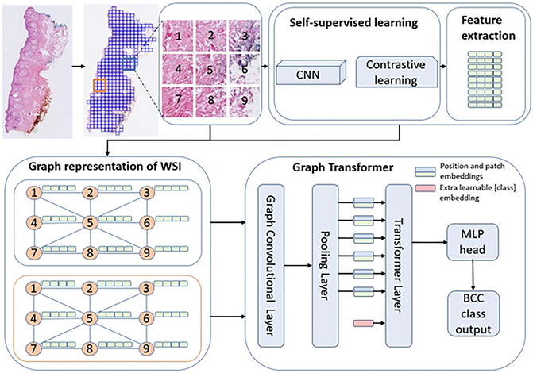

# Weakly supervised detection and classification of basal cell carcinoma using graph-transformer on whole slide images

## Abstract
The high incidence rates of basal cell carcinoma (BCC) cause a significant burden at pathology laboratories. The standard diagnostic process is time-consuming and prone to inter-pathologist variability. Despite the application of deep learning approaches in grading of other cancer types, there is limited literature on the application of vision transformers to BCC on whole slide images (WSIs). A total of 1832 WSIs from 479 BCCs, divided into training and validation (1435 WSIs from 369 BCCs) and testing (397 WSIs from 110 BCCs) sets, were weakly annotated into four aggressivity subtypes. We used a combination of a graph neural network and vision transformer to (1) detect the presence of tumor (two classes), (2) classify the tumor into low and high-risk subtypes (three classes), and (3) classify four aggressivity subtypes (five classes). Using an ensemble model comprised of the models from cross-validation, accuracies of 93.5%, 86.4%, and 72% were achieved on two, three, and five class classifications, respectively. These results show high accuracy in both tumor detection and grading of BCCs. The use of automated WSI analysis could increase workflow efficiency. See [full paper](https://www.nature.com/articles/s41598-023-33863-z).


## Install requirements
```bash
pip install -r requirements_gt.txt ## Can take up to 2 hours to install
```

## Dataset
The dataset is available in https://datahub.aida.scilifelab.se/10.23698/aida/bccc
 
## Architecture 
  

## Magnification of WSIs
The patch sizes should match to that in `simclr/config.yaml` (see below). To tile at different magnifications change `-m` value to the desired magnification levels. For example, `-m 1 2 -b 40` generates magnification at 20X and 10X (level 0, level 1, level 2, and level 3 correspond to 40X, 20X, 10X, and 5X, respectively). The base magnification for the dataset is 40X. See also [OpenSlide](https://openslide.org/api/python/) for details. The tiled slides will have this structure

## Tiling slides
```bash
deepzoom_tiler.py -m 1 2 -b 40 -v ndpi -j 32 --dataset bcc
```
```
root
|-- WSI
|   |-- bcc
|   |   |-- pyramid
|   |   |   |-- data
|   |   |   |   |-- BCC (x)_y_JS_z
|   |   |   |   |   |-- PATCH_LOW_1
|   |   |   |   |   |   |-- PATCH_HIGH_1.jpeg
|   |   |   |   |   |   |-- PATCH_HIGH_2.jpeg
|   |   |   |   |   |-- ...
|   |   |   |   |   |-- PATCH_LOW_1.jpeg
|   |   |   |   |   |-- ...
```

Note: While the published article focused on high magnification patches (20X), low and high magnification can be combined.

## Self-supervised learning layer (SimCLR) 
Make changes to `simclr/config.yaml` file as necessary. The [SimCLR](https://arxiv.org/pdf/2002.05709.pdf) paper shows the benefits of large batch size and epochs. In this project, 512 batch size and 32 epochs are used (However, the training can continue to get better results. Use fine tune option in the `simclr/config.yaml` file). For each magnification (10X and 20X) train SimCLR separately. To start training, run

```bash
cd simclr
python run.py --multiscale=1 --level=high --dataset bcc --wsi_address path/to/bcc/patch
```

You can follow training progress using:

```bash
cd simclr/runs
tensorboard --logdir path/to/dir --host 0.0.0.0 --port 8080  
```
**Note:**  
The `simclr/runs` directory contains **two pretrained models** trained on the BCC dataset above.

## Feature extraction

(1) **Training set**  
```bash
python compute_feats.py --dataset bcc --batch_size 8 --num_classes 5 --magnification high --weights_high simclr/runs/high_mag
```

(2) **Test set**  

```bash
python compute_feats.py --dataset bcc --batch_size 8 --num_classes 5 --magnification high --weights_high simclr/runs/high_mag --holdout_set True
```

Note: these results are saved in the `datasets` and `datasets_test_set` folders.


## Generate graphs
**Training (high magnifcation)**  
```bash
cd simclr
python build_graphs_double.py --weights simclr/runs/high_mag_bcc-0-0/checkpoints/model.pth --dataset "WSI/bcc/pyramid/data/*" --output "../graphs" --num_classes 5 --separate_feat 'high'

```

**Test (high magnifcation)**  
```bash
python build_graphs_double.py --weights simclr/runs/high_mag_bcc-0-0/checkpoints/model.pth --dataset "WSI/bcc/pyramid/data/*/" --output "../graphs" --num_classes 5 --holdout_set True --separate_feat 'high'
```


## Train for single magnification

See sample anntotation formats in `annotations` directory.  

```bash
bash scripts/train_all_low_high.sh
```

#### Test for single magnification

```bash
bash scripts/test_all_low_high.sh
```

Note: 
You can see the results in the `val_test_results` folder

## Explainability

To perform interpretability or visualization:

- Save the slide filename in `annotations/test_set_GT_build_cam.txt` as `BCC550 (1)` followed by `0` (tab separated).  
- Pick the task type (e.g. 2-class, 3-class, 5-class classification).  
- Open `scripts/get_graphcam.sh` and `scripts/vis_graphcam.sh` and set:  
  - `--resume` to the path of a trained model.  
  - Patch folder to something like `"WSI_test_set/bcc/pyramid/data/BCC332 (4)"`.  
- In `models/GraphTransofermer.py`, set `num_classes` to the desired value.  
- In `utils/datasets.py`, set `simclr_files_double` to the correct `graphs` folder.  

Then run:

```bash
bash scripts/get_vis_graphcam_AICC.sh
```

This internally calls:  
1. `bash scripts/get_graphcam.sh`   (use only one GPU, e.g. `CUDA_VISIBLE_DEVICES=0`)  
2. `bash scripts/vis_graphcam.sh`   (handles file renaming)  

> Outputs are saved in `graphcam_vis`.  
> For better visualization, adjust `p = np.clip(p, 0.8, 1)` in `src/vis_graphcam.py`.


---
 
## References
- [A graph-transformer for whole slide images classification](https://arxiv.org/pdf/2205.09671.pdf), ([code](https://github.com/vkola-lab/tmi2022)).

- [Multi-scale Domain-adversarial Multiple-instance CNN for Cancer Subtype
Classification with Unannotated Histopathological images](https://arxiv.org/pdf/2001.01599.pdf), ([code](https://github.com/binli123/dsmil-wsi)).


